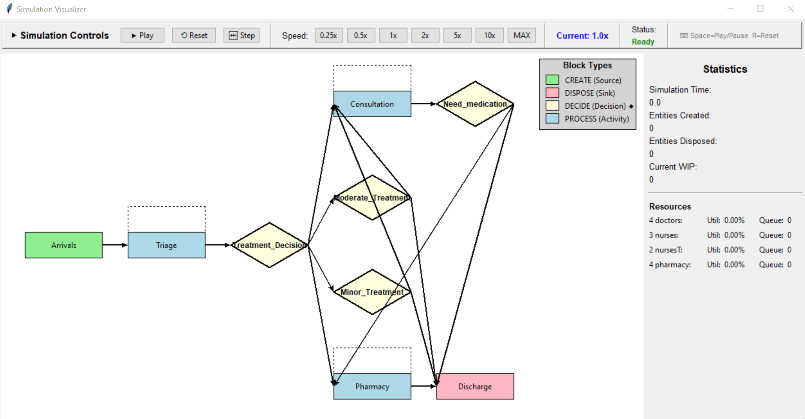
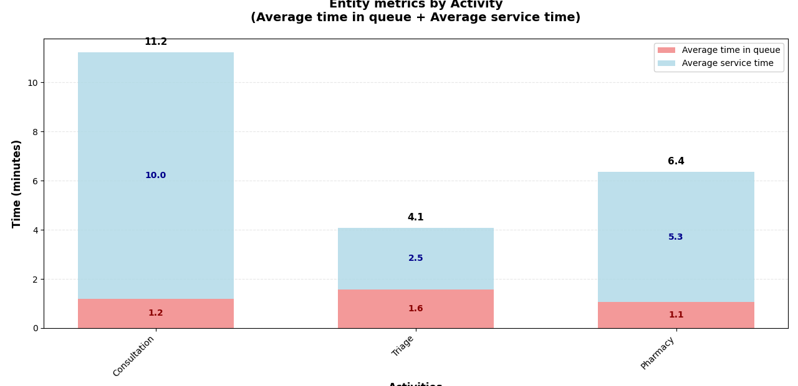
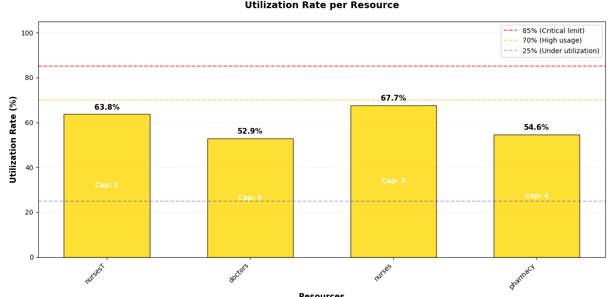
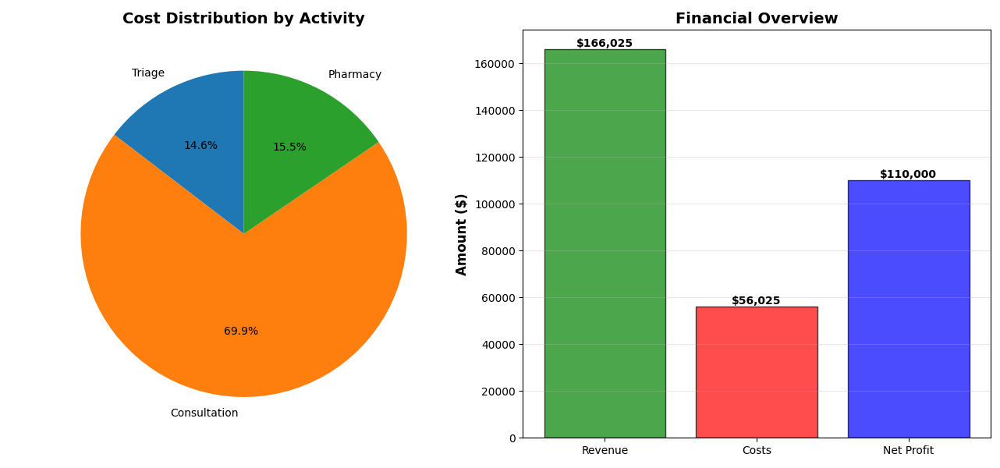
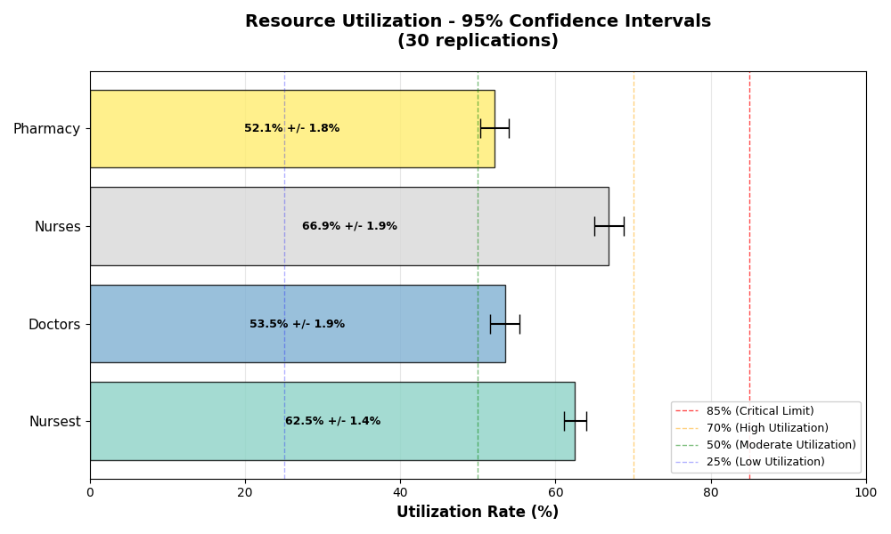
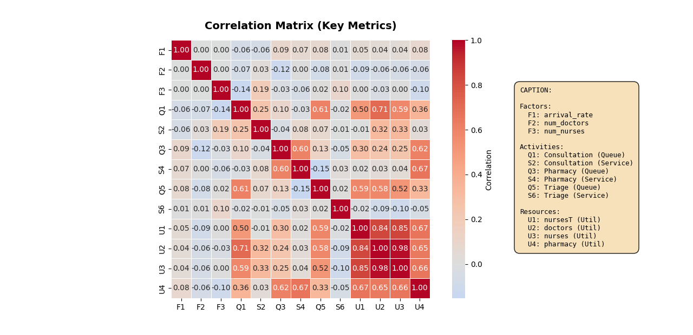

## 🎓 Example Models

1) **Hospital Emergency Department**
  Triage, multiple resources, priority routing, financial tracking (`hospital.py`)

2) **Restaurant Service**
  Multi-resource activities, dynamic attributes, financials (`2.py`)

3) **Call Center with Lost Calls**
  Trunk capacity, blocking, retrials, custom KPIs (`3.py`, `3a.py`, `3b.py`)


---
## 🎓 Running examples

For each example, you can run: (1) replication, (2) full simulation, (3) factorial analysis and (4) visualization.

DESK examples are executed **directly from the command line**, using explicit execution modes.


---

### 🔍 List available modes

To list the execution modes for a given model, e.g., `hospital.py`, type:

```bash
desk-sim -m examples/hospital.py --list-modes
```


```text
DESK execution modes:

  --mode single         → run a single replication
  --mode replications   → run the full simulation
  --mode factorial      → run a factorial analysis
  --mode visualization  → run simulation interface
```

---

### 🔁 Interactive visualization

Runs the model using the **DESK visualization interface**, enabling interactive inspection of the evolving system.

```bash
desk-sim -m examples/hospital.py --mode visualization
```



### ▶️ Running a single replication

Runs **one complete replication run**, with full tracing, reporting, plots, and diagnostics.

```bash
desk-sim -m examples/hospital.py --mode single
```






---

### 📊 Running the full simulation (multiple replications)

Runs **multiple independent replications**, aggregates results, and computes confidence intervals and statistical analysis.

```bash
desk-sim -m examples/hospital.py --mode replications
```


---

### 🧪 Factorial analysis

Runs a **factorial experiment**, varying model parameters and analyzing main and interaction effects.

```bash
desk-sim -m examples/hospital.py --mode factorial
```




### Simulation Report (example hospital)


```
============================================================
SIMULATION COMPLETE - ANALYZING RESULTS
============================================================
============================================================
📊 SIMULATION RESULTS (⏳ Duration: 24 hours)
WARM-UP: 2 hours | STATISTICS PERIOD: 22 hours
============================================================

STABILITY INDEX: 1.09
STATUS: Stable system

⏰ Average time in the system: 0.30 horas
👥 Total number of entities processed: 330
⚙️  Throughput: 15.00 entities/hour
📋 Active resources: ['nursesT', 'nurses', 'doctors', 'pharmacy']

NOTE: Statistics based only on the post-warm-up period
   (t > 2.0 hours)

WORK IN PROCESS (WIP) METRICS:
  Average WIP: 4.65 entities
  Maximum WIP: 11 entities
  Current WIP: 9 entities

TOTAL TIME IN SYSTEM:
  Average: 18.25 time units
  Std Dev: 8.59
  Min: 2.17
  Max: 44.92
  Median: 17.87
  Based on: 330 entities

LITTLE'S LAW VERIFICATION:
  L (Avg WIP): 4.65
  lambda (Throughput): 0.2500 entities/time unit
  W (Avg Time): 18.25 time units
  Expected WIP (lambda * W): 4.56
  Difference: 2.0%
  Status: Excellent match (Little's Law verified)

Analyzing warm-up period...

🔍 WARM-UP ANALYSIS:
==================================================
📋 nursesT:
   System may not be completely stabilized
   Final average usage: 43.0%
📋 doctors:
   System may not be completely stabilized
   Final average usage: 57.0%
📋 nurses:
   System may not be completely stabilized
   Final average usage: 69.7%
📋 pharmacy:
   System may not be completely stabilized
   Final average usage: 46.5%

RECOMMENDATIONS:
• Please note the charts to identify when usage stabilizes
• The warm-up period should last at least until the stabilization point
• Use a 20-30% additional margin on the stabilization time
• Complex systems may require a longer warm-up period
==================================================


EFFICIENCY ANALYSIS BY ACTIVITY:
=============================================
Consultation:
  Total time: 11.2 min
  Queue: 1.2 min (10.7%)
  Service: 10.0 min (89.3%)
  ✅ Efficient: only 10.7% of time in queues

Triage:
  Total time: 4.1 min
  Queue: 1.6 min (38.5%)
  Service: 2.5 min (61.5%)
  ⚠️  ATTENTION: 38.5% of time and waiting in queues

Pharmacy:
  Total time: 6.4 min
  Queue: 1.1 min (16.7%)
  Service: 5.3 min (83.3%)
  ✅ Efficient: only 16.7% of time in queues


RESOURCE UTILIZATION ANALYSIS:
==========================================
nursesT (Capacity: 2):
  Utilization rate: 63.8%
  ✅ GOOD: Moderate and efficient use

doctors (Capacity: 4):
  Utilization rate: 52.9%
  ✅ GOOD: Moderate and efficient use

nurses (Capacity: 3):
  Utilization rate: 67.7%
  ✅ GOOD: Moderate and efficient use

pharmacy (Capacity: 4):
  Utilization rate: 54.6%
  ✅ GOOD: Moderate and efficient use


==============================================================
RESOURCE CONFIGURATION SUMMARY
==============================================================

Resource: doctors
  Type: PriorityResource
  Capacity: 4 units
  Used by 1 block(s):
    - Consultation: 1 units (25% of capacity)
  Maximum single allocation: 1 units (25% of capacity)

Resource: nurses
  Type: PriorityResource
  Capacity: 3 units
  Used by 1 block(s):
    - Consultation: 1 units (33% of capacity)
  Maximum single allocation: 1 units (33% of capacity)

Resource: nursesT
  Type: PriorityResource
  Capacity: 2 units
  Used by 1 block(s):
    - Triage: 2 units (100% of capacity)
  Maximum single allocation: 2 units (100% of capacity)

Resource: pharmacy
  Type: PriorityResource
  Capacity: 4 units
  Used by 1 block(s):
    - Pharmacy: 2 units (50% of capacity)
  Maximum single allocation: 2 units (50% of capacity)
==============================================================

📈 METRICS BY RESOURCE:
  nursesT (capacity: 2):
    Utilization rate: 0.64
    Time Busy: 841.69 (63.8%)
    Time Idle: 469.63 (35.6%)
    Maximum in queue: 10
    Maximum in service: 2
    Average number in queue: 0.53
    Average number in service: 1.28
    Analysis (💡): System operating within expected parameters.

  doctors (capacity: 4):
    Utilization rate: 0.53
    Time Busy: 1204.78 (91.3%)
    Time Idle: 111.46 (8.4%)
    Maximum in queue: 2
    Maximum in service: 4
    Average number in queue: 0.01
    Average number in service: 2.12
    Analysis (💡): System operating within expected parameters.

  nurses (capacity: 3):
    Utilization rate: 0.68
    Time Busy: 1204.78 (91.3%)
    Time Idle: 111.46 (8.4%)
    Maximum in queue: 3
    Maximum in service: 3
    Average number in queue: 0.09
    Average number in service: 2.03
    Analysis (💡): System operating within expected parameters.

  pharmacy (capacity: 4):
    Utilization rate: 0.55
    Time Busy: 951.26 (72.1%)
    Time Idle: 364.99 (27.7%)
    Maximum in queue: 8
    Maximum in service: 4
    Average number in queue: 0.21
    Average number in service: 2.19
    Analysis (💡): System operating within expected parameters.


Entities created: 368
Entities disposed: 330
Entities in the system: 38

BLOCK STATISTICS:

Arrivals (CreateBlock):

Triage (ProcessBlock):
  Entities processed: 335
  Average time in service: 2.51
  Average time in queue: 1.64

Consultation (MultiProcessBlock):
  Entities processed: 266
  Average time in service: 10.03
  Average time in queue: 1.23


Pharmacy (ProcessBlock):
  Entities processed: 269
  Average time in service: 5.30
  Average time in queue: 1.07


============================================================
FINANCIAL BALANCE SHEET
============================================================

Based on 330 entities (post warm-up)

REVENUE:
  Total Revenue: $166,025.33
  Average per Entity: $503.11

COSTS BY ACTIVITY:
  Consultation: $39,167.39 (69.9%)
  Pharmacy: $8,674.93 (15.5%)
  Triage: $8,182.62 (14.6%)

  Total Costs: $56,024.94
  Average per Entity: $169.77

------------------------------------------------------------

NET PROFIT: $110,000.39
   Average per Entity: $333.33
   Profit Margin: 66.3%
   Excellent profit margin
============================================================

```
