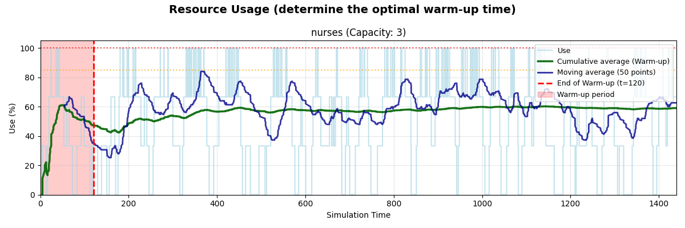
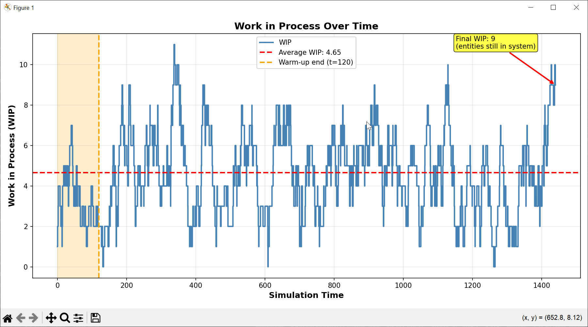

## 🔬 Validation & Verification

DESK includes:

* Stability checker (utilization ρ < 1)
* Little’s Law analysis
* Resource consistency validation
* Automated warm-up suggestion

---

- **Stability Analysis**: Preliminary capacity analysis on utilization (ρ < 1)
- **Little’s Law verification**: Automatic analysis on stability (**L = λW**). *The average number of items in the system (L) is the average arrival rate (λ) multiplied by the average time an item spends in the system (W)* 
- **Warm-Up Analysis**: Automated transient detection

---

### Visualization & Reporting
- **Real-Time Visualization**: Process animation during simulation

- **Statistical Plots**:
  - Resource utilization over time
  - WIP evolution
  - System time distributions
  - Activity-level metrics

- **BupaR Integration**: Process mining and animation files for ProcessAnimate in R ([processanimateR](https://bupaverse.github.io/processanimateR/)).

The resulting event-log .csv file is stored in result/ folder, e.g., `hospital_event_log.csv` file, to produce the animation below. The R code of the example (`hospital_bupar.R`) is available in r_animation/ folder.

---

